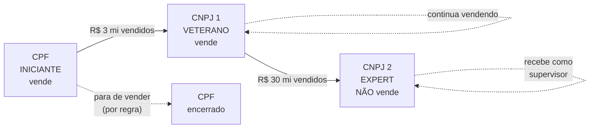
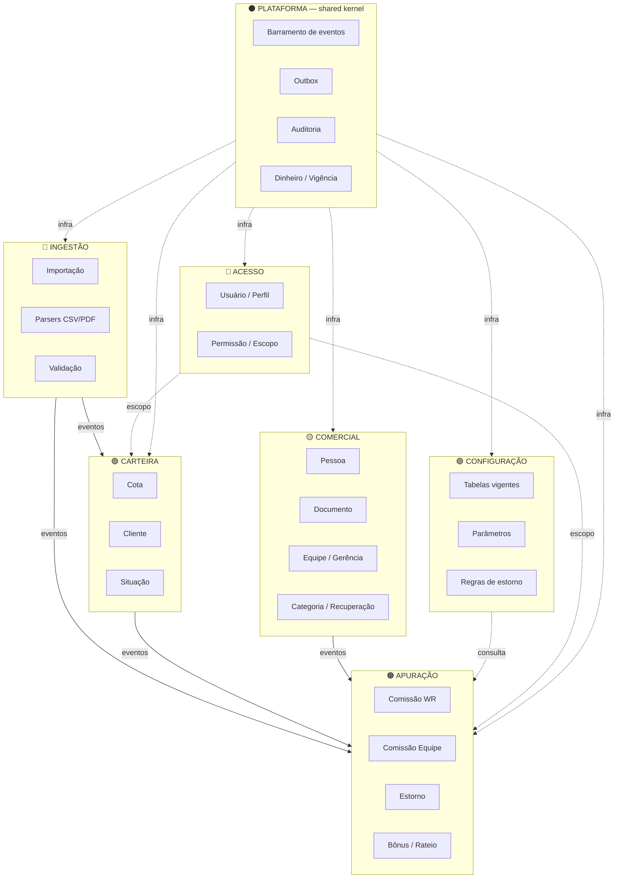
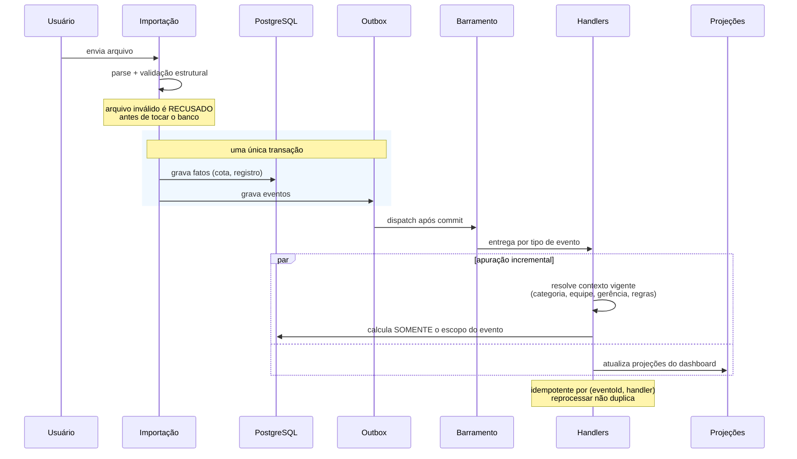
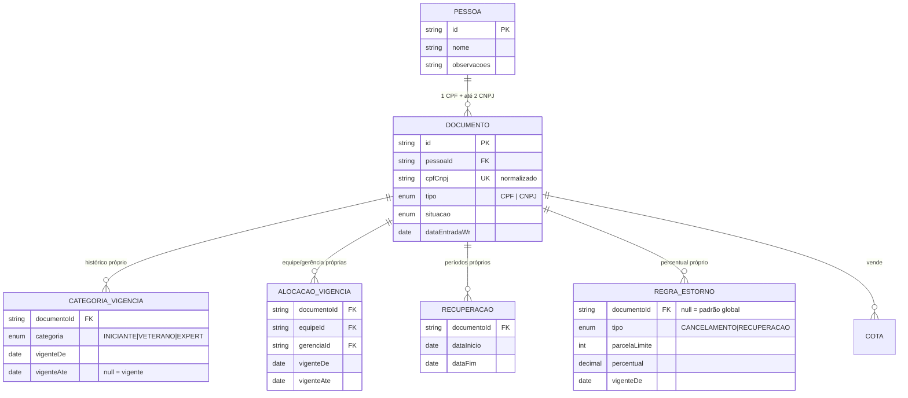
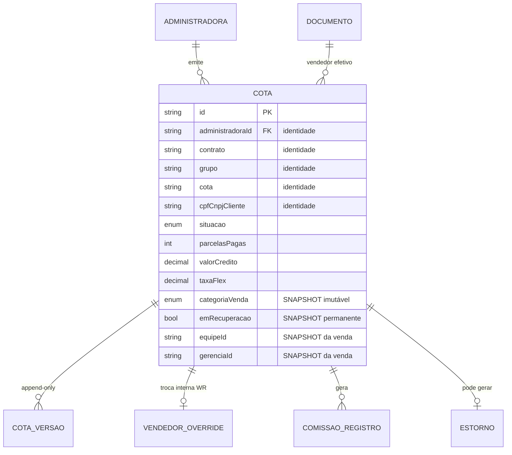
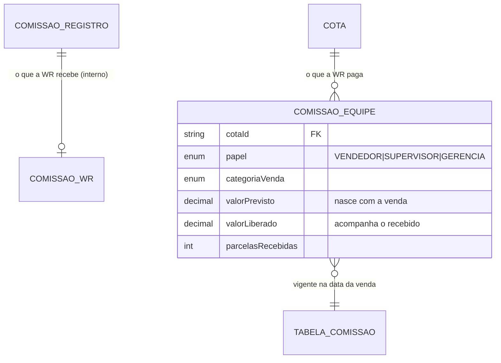
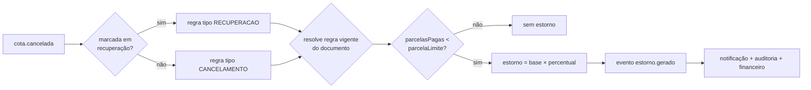

# Arquitetura — ERP WR Consórcio

> Documento vivo. Descreve o domínio, o modelo de dados, a arquitetura de
> execução e a organização do código. **Leia antes de escrever qualquer linha.**

---

## 0. Premissas assumidas

Duas decisões mudam o modelo de dados e o cálculo de dinheiro. Elas foram
levantadas e, sem resposta, seguiram pelo caminho abaixo. **Se alguma estiver
errada, corrija aqui primeiro — o código segue este documento.**

| # | Questão | Decisão assumida | Impacto se estiver errada |
|---|---|---|---|
| ~~P1~~ | ~~Categoria pertence à pessoa ou ao documento?~~ | **RESPONDIDO pela WR: ao documento.** Ver §2.2 — não são categorias soltas, é uma trilha de progressão. | — |
| P2 | Reescrever do zero ou reestruturar o que existe? | **Reestruturar in-place.** Existem ~7.500 linhas de regra testada e refinada contra arquivos reais (parsers de PDF por coordenada de glifo, identidade de cota, precedência de vendedor). Jogar fora seria destruir conhecimento de domínio caro e difícil de recuperar. | Baixa. A estrutura de pastas alvo (§7) é a mesma nos dois caminhos. |

Sobre P2, vale ser direto: o pedido foi "não reutilize arquiteturas simples nem
faça um CRUD comum". O que existe hoje **não é** um CRUD — é um núcleo de regras
puras e testadas com uma casca de telas mal organizada. O problema real não é a
qualidade das regras, é a **ausência de fronteiras**: `services/` acessa Prisma
direto, telas chamam serviço, e o cálculo roda em varredura total. A refatoração
ataca exatamente isso, sem sacrificar o que já foi validado.

---

## 1. O que este sistema é

A WR **não é administradora de consórcio**. É parceira comercial. Consequências
que atravessam todo o desenho:

1. **A WR não é a fonte da verdade.** A administradora é. Todo dado nasce de um
   arquivo oficial importado. Não existe cadastro manual de venda ou de cliente.
2. **O sistema é um interpretador de arquivos, não um formulário.** O valor está
   em ler corretamente, conciliar e calcular — não em capturar dados.
3. **O passado é imutável.** Uma venda de 2024 é apurada com a categoria, a
   tabela e a estrutura que valiam em 2024. Promover alguém hoje não pode mexer
   em um centavo do que já foi apurado.
4. **Nada é apagado.** Cancelamento é mudança de situação, não exclusão.

### 1.1 Fontes de dados

| Arquivo | Formato | O que traz | Papel no domínio |
|---|---|---|---|
| Base de Clientes | CSV | Carteira completa: cotas, clientes, situação, parcelas pagas | Estado atual da carteira. Dispara eventos de mudança. |
| CV056E | PDF | Comissão que a administradora paga **à WR** | Receita da WR. Base do que a WR repassa. **Nunca exibida ao usuário final.** |
| CV069E | PDF | Comissão paga **direto ao vendedor** pela administradora | Veterano e Expert. A WR não desembolsa, mas precisa do valor para calcular estorno. |
| GC070A | PDF | Bônus de incentivo | Não gera pagamento. Serve para descobrir **de qual gerência** veio o valor. |

---

## 2. Linguagem ubíqua

Termos com significado preciso. Usar exatamente estes nomes em código, banco e
tela — sem sinônimos.

| Termo | Definição |
|---|---|
| **Pessoa** | O ser humano. Unidade de identidade. É o que aparece na listagem do módulo Comercial — **uma linha por pessoa**. |
| **Documento** | Um CPF ou CNPJ pelo qual a pessoa opera. Máximo **3** por pessoa: 1 CPF + até 2 CNPJs. É a unidade de **operação e cálculo**: categoria, equipe, gerência, recuperação, comissão e estorno pertencem ao documento. |
| **Cota** | Uma linha da carteira. Um cliente com três cotas gera **três registros**. Identidade = administradora + contrato + grupo + cota + CPF/CNPJ do cliente. |
| **Categoria** | Iniciante, Veterano ou Expert. Propriedade **do documento**, com vigência temporal. |
| **Categoria da venda** | Snapshot congelado no momento da venda. Nunca recalculado. É o que decide o dinheiro. |
| **Recuperação** | Período em que o documento opera sob condição especial. Vendas feitas dentro do período ficam marcadas **permanentemente**. |
| **Estorno** | Devolução de comissão. Dois tipos: por **cancelamento** e por **recuperação**. Percentual **configurável por documento**. |
| **Rateio** | Distribuição de um valor pelas unidades (gerência / equipe / vendedor) que o originaram. |
| **Vigência** | Par (vigenteDe, vigenteAte). Nunca se sobrescreve: encerra-se o período anterior e abre-se um novo. |
| **Apuração** | Cálculo de quanto cada parte tem a receber sobre uma venda. |
| **Evento** | Fato ocorrido e imutável. É o gatilho de toda apuração. |

### 2.1 Regras de dinheiro (invariantes)

Estas não são preferências. São invariantes do domínio e cada uma tem teste.

| # | Invariante |
|---|---|
| R1 | A categoria pertence **à venda**, não ao vendedor. Congelada na data da venda. |
| R2 | **Supervisão recebe SOMENTE sobre vendas de Iniciante.** Nunca sobre Veterano ou Expert. |
| R3 | **Gerência recebe sobre TODAS as categorias.** |
| R4 | Veterano e Expert recebem **direto da administradora**. A WR não paga — mas controla o valor para calcular estorno. |
| R5 | O bônus GC070A **não gera pagamento**. Serve apenas para atribuir a gerência de origem. |
| R6 | A comissão que a WR recebe é **interna**. Nunca aparece em tela para nenhum perfil. |
| R7 | Marcação de recuperação é **permanente**. Encerrar o período não desmarca venda nenhuma. |
| R8 | Nenhum percentual, limite ou prazo é constante no código. Tudo vem de configuração com vigência. |
| R9 | A base de comissão é crédito × percentual do Flex. |
| R10 | Cancelamento **nunca** apaga. Muda situação e dispara verificação de estorno. |

### 2.2 A trilha de progressão

Informado pela WR. **É o coração do módulo Comercial** e explica por que a
categoria pertence ao documento e não à pessoa.

A pessoa não escolhe categoria: ela **progride**, e cada degrau abre um
documento novo.



| Documento | Categoria | Vende? | Papel |
|---|---|---|---|
| CPF | Iniciante | Sim, até ser promovido | Entrada. **Para de vender ao virar Veterano — por regra.** |
| CNPJ 1 | Veterano | **Sim** | É por onde a pessoa opera depois de promovida, para sempre. |
| CNPJ 2 | Expert | **Não** | Identidade pela qual recebe **supervisão** sobre os Iniciantes da equipe. |

Consequências que o modelo precisa respeitar:

1. **Só um documento vende por vez.** Venda que chegar num documento já
   encerrado é anomalia e deve virar alerta, não cálculo silencioso.
2. **Virar Expert não para de vender.** Ele continua vendendo pelo CNPJ
   veterano; o CNPJ expert é o veículo da supervisão. Isso casa com R2 —
   supervisão só recebe sobre venda de Iniciante, e é da equipe dele.
3. **As metas são parâmetro, não constante** (R8). R$ 3 mi e R$ 30 mi vivem em
   configuração com vigência.
4. **"Vendedores aptos para promoção"**, no Dashboard, é exatamente o
   acumulado cruzando esses limites.
5. **A categoria da venda continua congelada.** Promover não reescreve nada do
   que já foi vendido.

**Os limites contam a carteira completa.** Informado pela WR: o acumulado é de
**todas as vendas da pessoa**, somando os documentos — não só o que passou pelo
CNPJ veterano. É por isso que o consolidado da pessoa não é enfeite de tela: é o
número que dispara a promoção, e precisa ser confiável.

### 2.3 Quando há estorno

Informado pela WR. Só existem **dois** momentos:

| Situação | Limite | Categorias | Estado |
|---|---|---|---|
| Venda feita em **recuperação** | abaixo de 6 parcelas pagas | Veterano + Expert | Configurado |
| Cliente cancela com **uma parcela paga** | abaixo de 2 parcelas pagas | Veterano + Expert | Configurado |

**Iniciante nunca estorna.** Não é exceção: é a mecânica do negócio. Veterano e
Expert recebem direto da administradora, e é esse dinheiro que volta. A comissão
de Iniciante é a WR que paga à própria equipe — e a WR não cobra de volta o que
ela mesma pagou.

Fora desses dois casos não se cobra nada do vendedor.

Os dois são linhas em `RegraEstorno`, com vigência e percentual — nenhum deles
está em código. Um vendedor pode ter percentual próprio, e a regra dele vence a
padrão.

---

## 3. Bounded Contexts

Sete contextos. A fronteira é onde a linguagem muda de dono.



**Regra de dependência:** contextos **nunca** se importam diretamente. Comunicam
por evento (assíncrono) ou por porta declarada no contexto consumidor
(síncrono). Isso é o que permite extrair qualquer contexto para um serviço
próprio no dia em que o volume exigir.

---

## 4. Arquitetura de execução — orientada a eventos

O ponto mais importante do sistema e o que o separa de um CRUD.

### 4.1 O problema com o modelo atual

Hoje: importa → grava tudo → **recalcula a base inteira**. Com dezenas de
milhares de vendedores e centenas de milhares de cotas isso é inviável: custo
proporcional ao tamanho do histórico, não ao tamanho da mudança.

### 4.2 O modelo alvo

Custo proporcional **ao que mudou**.



### 4.3 Por que outbox transacional

O evento é gravado **na mesma transação** do fato que o originou. Isso elimina a
falha clássica: fato gravado e evento perdido → comissão que nunca é calculada e
ninguém percebe. Com outbox, ou os dois existem ou nenhum existe.

O dispatcher processa após o commit, com retry e backoff. Um handler que falha
não trava a importação nem perde o evento — ele fica pendente e visível.

### 4.4 Catálogo de eventos

Nome no padrão `contexto.agregado.fato` — sempre no **passado**, porque evento é
fato consumado.

| Evento | Origem | Consequência |
|---|---|---|
| `carteira.cota.criada` | Base CSV | Congela categoria/equipe/gerência da venda. Apura comissão prevista. |
| `carteira.cota.alterada` | Base CSV | Versiona. Reavalia só o que o diff afetou. |
| `carteira.cota.cancelada` | Base CSV | **Verifica estorno.** Notifica. Audita. |
| `carteira.cota.contemplada` | Base CSV | Atualiza projeção. |
| `carteira.cota.parcela_paga` | CV056E | Libera parcela da comissão prevista. |
| `carteira.cota.vendedor_alterado` | Override WR | Reapura a cota para o novo dono. |
| `comercial.documento.vinculado` | Manual / automático | Reprocessa pendências daquele documento. |
| `comercial.categoria.alterada` | Manual | Abre vigência. **Não mexe em venda passada.** |
| `comercial.alocacao.alterada` | Manual | Abre vigência de equipe/gerência. |
| `comercial.recuperacao.iniciada` | Manual | Marca vendas do período. |
| `comercial.documento.apto_promocao` | Regra de meta | Alerta no dashboard. |
| `apuracao.comissao.registrada` | CV056E | Cruza com a cota. |
| `apuracao.comissao.apurada` | Handler | Alimenta o financeiro. |
| `apuracao.estorno.gerado` | Handler | Notifica. Audita. Entra no financeiro. |
| `apuracao.bonus.rateado` | GC070A | Atribui gerência de origem. |
| `ingestao.importacao.concluida` | Importação | Fecha o resumo. |
| `ingestao.importacao.falhou` | Importação | Alerta no dashboard. |

### 4.5 Contrato do handler

```
handler(evento, portas) → efeitos
```

- **Puro na decisão, isolado no efeito.** A regra decide; a porta persiste.
- **Idempotente.** Chave `(eventoId, handler)`. Reprocessar é seguro por
  construção — não por sorte.
- **Escopo mínimo.** O evento carrega os ids exatos. Handler que faz varredura
  ampla é bug de design.
- **Falha isolada.** Um handler quebrado não derruba os outros.

---

## 5. Modelo de domínio

### 5.1 Pessoa e Documento — o núcleo do Comercial

O conceito **não é "vendedor"**. É **pessoa**, e a pessoa opera por até três
documentos.



**Invariantes do agregado Pessoa:**

- No máximo **1 CPF** e **2 CNPJs**. Total **3**. Validado no domínio, não só na
  tela — e reforçado por índice parcial no banco.
- Documentos são **independentes** para efeito de cálculo. Categoria do CNPJ 1
  não influencia a do CPF.
- A **consolidação** (total vendido, clientes, estornos, comissões, recebido,
  documentos) é uma **projeção de leitura** sobre os documentos — nunca um campo
  gravado que pode divergir.
- Desvincular um documento **não apaga** nada: encerra a vigência do vínculo e
  registra em histórico append-only.

**Por que o documento é a unidade de cálculo e não a pessoa:** é assim que a
administradora paga. O arquivo vem por documento. Fazer o cálculo por pessoa
exigiria uma agregação que a fonte da verdade não faz — e que quebraria na
conciliação.

### 5.2 Carteira



Os campos marcados **SNAPSHOT** são o coração de R1. Gravados uma vez, na
criação, e nunca recalculados. É o que garante que promover alguém não reescreve
o passado.

**Situação `CANCELADO`** nunca remove a linha. Dispara
`carteira.cota.cancelada`, e o handler verifica estorno (§5.4).

### 5.3 Apuração



Separação deliberada em três fluxos de dinheiro:

| Fluxo | Modelo | Visível ao usuário? |
|---|---|---|
| Administradora → WR | `ComissaoWr` | **Não.** R6. Só alimenta cálculo. |
| WR → equipe (Iniciante, supervisão, gerência) | `ComissaoEquipe` | Sim. É o Financeiro. |
| Administradora → vendedor (Veterano, Expert) | `ComissaoVendedorAdm` | Sim, como informação. Não gera obrigação da WR. |

`valorPrevisto` × `valorLiberado` é o que permite ao Financeiro mostrar previsto
e realizado sem recalcular nada: o previsto nasce com a venda, o liberado avança
conforme `carteira.cota.parcela_paga`.

### 5.4 Estorno — parametrizado

O briefing é explícito: **dois tipos**, percentual **configurável por vendedor**,
nunca fixo. O código atual tem `PARCELA_LIMITE_ESTORNO = 6` constante — viola R8
e é o primeiro alvo da refatoração.



Resolução da regra, em ordem: regra **do documento** vigente na data do
cancelamento → regra **global** vigente → sem estorno. Nunca cai em constante.

---

## 6. Os seis módulos

Seis. Não mais. A navegação atual tem quinze itens em três grupos — vira o menu
que o briefing pede para não existir.

| Módulo | Contém | Perfis |
|---|---|---|
| **1. Dashboard** | Rateios por gerência/equipe/vendedor, previsões, cancelados, estornos novos, importações com erro, mudanças de categoria, aptos a promoção, alertas | Todos (com escopo) |
| **2. Comercial** | Pessoas (1 linha/pessoa) → ficha com documentos + consolidado, equipes, gerências, vínculos, pendências, promoções | Admin, RH, Gerente, Supervisor |
| **3. Carteira** | Cotas (1 linha/cota), ficha do cliente, histórico, troca de vendedor, comissões e estornos da cota | Admin, Financeiro, Gerente, Supervisor |
| **4. Financeiro** | Previsto de iniciantes / supervisão / gerência, estornos, rateios, bônus. **Nunca o que a WR recebe.** | Admin, Financeiro |
| **5. Importações** | Envio, validação, histórico com usuário/data/hora/erros/quantidade/tempo | Admin, Financeiro |
| **6. Administração** | Configurações (percentuais, categorias, promoções, metas, flex, recuperação, estorno), usuários, permissões, auditoria, backups | Admin |

O que hoje são telas soltas (`/bonus`, `/vinculos`, `/pendencias`,
`/comissoes-equipe`, `/tabelas`, `/usuarios`, `/auditoria`, `/backups`) vira
**aba dentro do módulo** que já é dono do assunto. Menos cliques, não mais.

**Dashboard e R6:** o rateio é exibido; o que a WR recebe, não. Os dois saem do
mesmo cálculo, então a barreira precisa ser de **projeção**, não de tela — o
DTO que chega no cliente simplesmente não tem o campo. Esconder no componente
seria vazar no payload.

---

## 7. Estrutura de pastas

Camadas por **contexto**, não por tipo técnico. Um `services/` global vira um
depósito — é o que aconteceu aqui.

```
src/
├── modules/                        um diretório por bounded context
│   ├── comercial/
│   │   ├── domain/                 ← ZERO dependências externas
│   │   │   ├── entities/           Pessoa, Documento
│   │   │   ├── value-objects/      CpfCnpj, Categoria, Periodo
│   │   │   ├── events/             eventos que o contexto publica
│   │   │   ├── rules/              funções puras, testáveis isoladamente
│   │   │   └── ports/              interfaces dos repositórios
│   │   ├── application/            orquestração
│   │   │   ├── use-cases/          um arquivo, um caso de uso
│   │   │   ├── handlers/           reação a eventos
│   │   │   └── dto/                contratos de entrada e saída
│   │   ├── infrastructure/         detalhes substituíveis
│   │   │   ├── repositories/       implementação Prisma das ports
│   │   │   └── queries/            leitura otimizada (SQL quando vale)
│   │   └── presentation/           server actions + componentes do módulo
│   ├── carteira/
│   ├── apuracao/
│   ├── ingestao/
│   ├── configuracao/
│   └── acesso/
│
├── shared/                         shared kernel
│   ├── domain/                     Dinheiro, Vigencia, DomainEvent, Result
│   ├── events/                     bus, outbox, dispatcher, registry
│   ├── audit/                      trilha de auditoria
│   └── errors/                     hierarquia de erros do domínio
│
├── app/                            Next.js App Router — só roteamento
│   └── (app)/
│       ├── dashboard/
│       ├── comercial/
│       ├── carteira/
│       ├── financeiro/
│       ├── importacoes/
│       └── administracao/
│
└── components/ui/                  design system, agnóstico de domínio
```

### 7.1 Regra da dependência

```
presentation → application → domain
                    ↓
             infrastructure (implementa ports do domain)
```

`domain/` **não importa Prisma, Next, React ou qualquer biblioteca**. Se importar,
a camada está errada. Isso não é purismo: é o que torna a regra de negócio
testável em milissegundos, sem banco, e o que permite trocar o ORM sem tocar em
uma regra.

---

## 8. Decisões arquiteturais (ADR)

### ADR-01 — Outbox transacional em vez de fila externa
**Contexto:** eventos precisam sobreviver a falhas; o deploy é Vercel + Postgres.
**Decisão:** outbox no próprio Postgres, dispatch pós-commit.
**Porquê:** entrega exatamente-uma-vez sem infra adicional. Fila externa (SQS,
Redis) só se justifica com volume que ainda não existe — e a porta do dispatcher
permite trocar depois sem mexer nos handlers.
**Custo aceito:** latência de segundos, não milissegundos. Irrelevante para
fechamento comercial.

### ADR-02 — Snapshot em vez de recálculo temporal
**Contexto:** R1 exige que o passado seja imutável.
**Decisão:** congelar categoria/equipe/gerência na cota, na criação.
**Porquê:** a alternativa (reconstruir o contexto histórico a cada leitura) é
correta mas custa uma resolução de vigência por linha em todo relatório. Com
centenas de milhares de cotas, inviável. O snapshot é O(1) na leitura.
**Custo aceito:** correção de snapshot errado exige comando explícito e
auditado. É o comportamento desejado — não deve ser fácil.

### ADR-03 — Projeções de leitura para o Dashboard
**Contexto:** o dashboard é "tempo real" e agrega toda a base.
**Decisão:** tabelas de projeção atualizadas por evento, não agregação ao vivo.
**Porquê:** agregação ao vivo sobre centenas de milhares de linhas degrada com o
crescimento e ainda é paga a cada F5. A projeção move o custo para o momento da
escrita, que é raro (importação), e torna a leitura constante.
**Custo aceito:** consistência eventual de segundos. Aceitável — o dado de
origem chega por arquivo, não por segundo.

### ADR-04 — Decimal, nunca float
**Contexto:** dinheiro.
**Decisão:** `Decimal(18,2)` no banco, tipo `Dinheiro` no domínio, arredondamento
comercial explícito.
**Porquê:** float erra em centavos e o erro acumula em rateio. Um centavo de
divergência num fechamento é uma reunião.

### ADR-05 — Configuração com vigência, nunca constante
**Contexto:** R8.
**Decisão:** todo percentual, limite e prazo vive em tabela versionada por
vigência, resolvida **pela data do fato**.
**Porquê:** mudar regra não pode exigir deploy, e não pode reescrever o passado.
**Consequência imediata:** `PARCELA_LIMITE_ESTORNO = 6` sai do código.

### ADR-06 — Idempotência por construção
**Contexto:** reprocessamento é normal (retry, reimportação, correção).
**Decisão:** toda escrita derivada de evento tem chave natural determinística.
**Porquê:** a alternativa é apagar e recriar — que viola "nada é apagado" e abre
janela de inconsistência.

---

## 9. Plano de execução

Ordem escolhida para que o sistema **nunca fique quebrado** entre etapas. Cada
fase entrega valor sozinha.

### Fase 1 — Fundação ✅
- [x] Modelagem do domínio, ER, arquitetura, pastas *(este documento)*
- [x] Shared kernel: `dinheiro`, `periodo`, `resultado`
- [x] Outbox transacional + barramento + despachante + registro
- [x] Rateio que fecha ao centavo

### Fase 2 — Parametrização (mata R8) *(em andamento)*
- [x] `RegraEstorno` com os dois tipos, percentual por vendedor, vigência
- [x] Remoção de `PARCELA_LIMITE_ESTORNO`, com equivalência provada em teste
- [ ] Tela de configuração das regras *(hoje só por SQL / seed)*
- [ ] Demais constantes de regra ainda no código

### Fase 3 — Comercial por documento *(em andamento)*
- [x] Migração das vigências de Pessoa → Documento *(backfill replica, não move)*
- [x] Invariante 1 CPF + 2 CNPJ — CPF no banco, CNPJ no domínio
- [x] Regras da trilha: documento que vende, venda em documento encerrado
- [x] Regras de promoção com metas por vigência
- [x] `MetaPromocao` persistida, com as duas metas semeadas (3 mi / 30 mi)
- [x] Consolidado da pessoa em SQL (volume da carteira completa)
- [x] Fila de aptos para promoção, no Dashboard
- [ ] Tela de configuração das metas *(hoje só por SQL)*
- [x] Lista por pessoa com volume da carteira e aptidão
- [x] Ficha com a trilha de progressão e a categoria de cada documento
- [ ] Alerta de venda em documento encerrado
- [ ] Ação de promover (hoje a promoção é manual, documento a documento)

### Fase 4 — Eventos na importação *(parcial)*
- [x] Base CSV publica `cota.criada`, `cota.alterada`, `cota.cancelada`, `cota.contemplada`
- [x] Handler de estorno consome e apura pela regra vigente
- [ ] CV056E, CV069E e GC070A ainda calculam direto
- [ ] Aposentadoria do recálculo por varredura (`apurarComissoesEquipe` ainda varre tudo)
- [ ] Rota de manutenção que recolhe eventos pendentes fora da importação

### Fase 5 — Os seis módulos *(não iniciada)*
- [ ] Reorganização das rotas e da navegação
- [ ] Projeções e dashboard em tempo real
- [ ] Filtros inteligentes, busca instantânea

### 9.1 Compatibilidade

A refatoração é feita com **strangler pattern**: o código novo convive com o
antigo, rota por rota, até a última ser migrada. Em nenhum momento existe um "big
bang" que exija congelar a operação.

### 9.2 Reversibilidade da P1

A migração de vigências Pessoa → Documento **copia**, não move. As colunas
`pessoaId` dos históricos permanecem preenchidas. Se a premissa P1 estiver
errada, reverter é trocar a resolução de volta para `pessoaId` — sem perda de
dado e sem migração de volta.

---

## 10. Escala

Alvo: dezenas de milhares de documentos, centenas de milhares de cotas.

| Frente | Decisão |
|---|---|
| Leitura | Projeções materializadas; agregação em SQL, nunca em JS |
| Escrita | Lote com `createMany`, cache de resolução em memória por importação |
| Índices | Compostos nas colunas de filtro real (`dataReferencia`, `gerenciaId`, `equipeId`, identidade da cota) |
| Cálculo | Incremental por evento. Custo ∝ mudança, não ∝ base |
| Paginação | Cursor, nunca `OFFSET` — `OFFSET` degrada linearmente |
| Importação | Streaming; arquivo grande nunca inteiro em memória |
| Auditoria | Append-only, particionável por data quando crescer |
